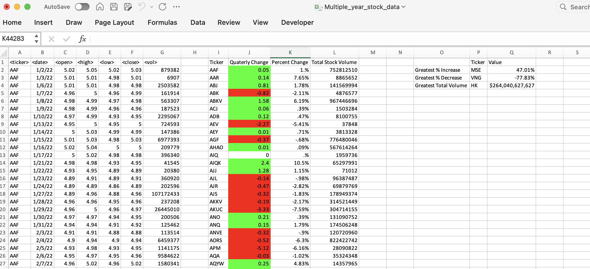

# VBA Analysis

## Website: 
[website](https://github.com/leo042024/VBA-Analysis)

## Description
This project summarized stock tickers over a period of time. Here we found the greatest percent increase, greatest percent decrease and the greatest volume change. I evaluated multiple worksheets broken into different quarters.

## Table of Contents
- [Installation](#installation)
- [Usage](#usage)
- [Credits](#credits)
- [License](#license)
- [Features](#features)

- [Contact](#contact)

## Installation
VBA & Excel 

## Usage
This project can be used to review stock data to help make informed decisions. 

## Credits
Leomar Crowal with the help of great resources during tutor sessions and office hours. 

## License
MIT

## Features
A easy to read and color coded visuals.

## Contact
If there are any questions or concerns, I can be reached at:
##### [github: leo042024](https://github.com/leo042024)
##### [email: lcrowal@icloud.com](mailto:lcrowal@icloud.com)
